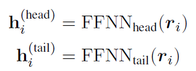
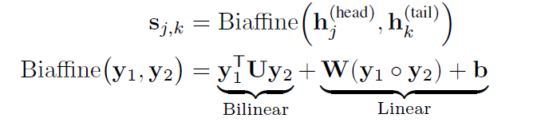
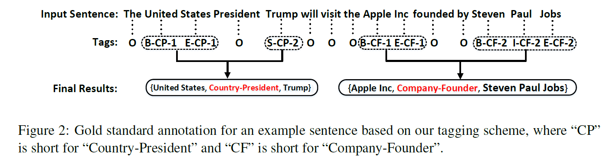
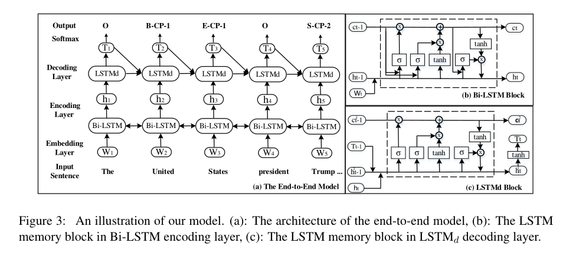
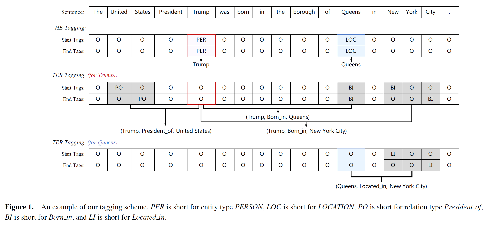
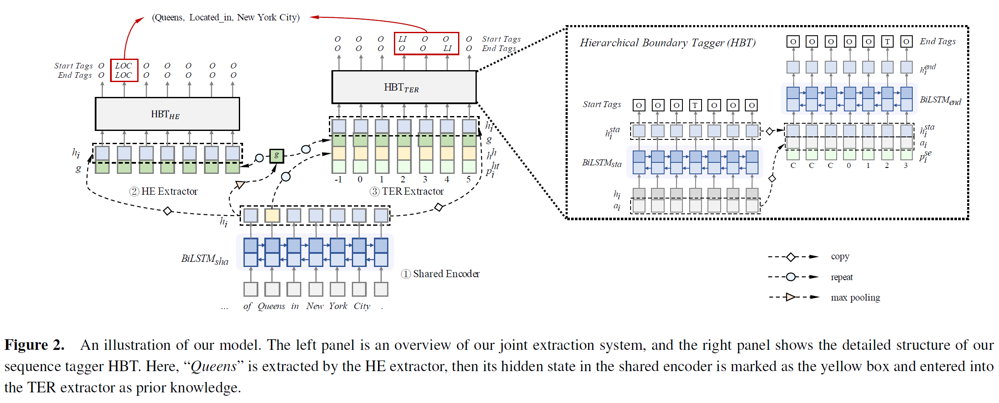
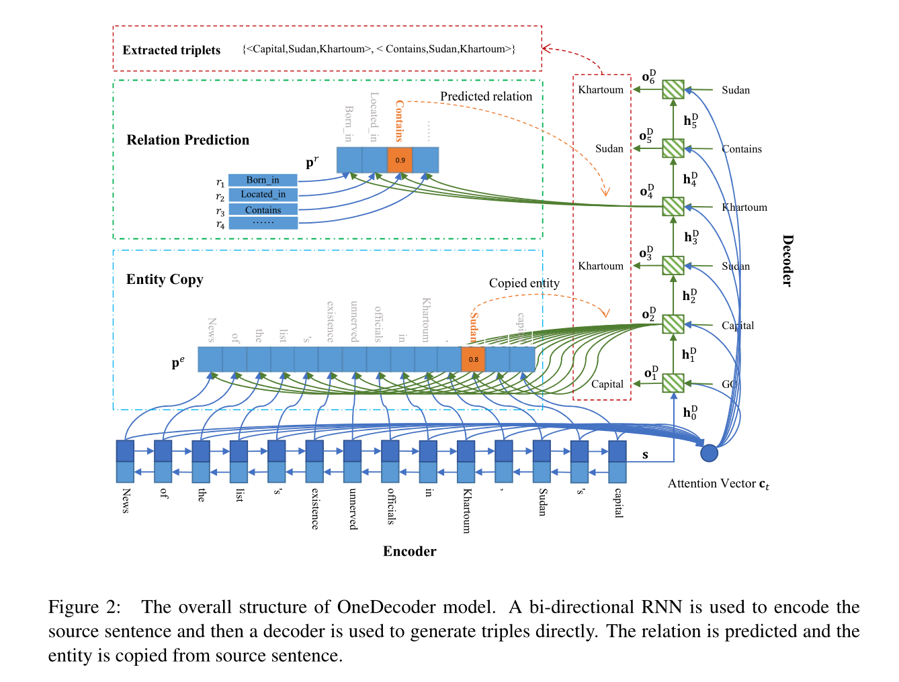

##### 先实体后关系（非 完全意义上的 联合抽取）

缺点：先实体 后关系，判断关系的时候利用到了实体，但判断实体的时候没有利用到关系，并不是双向的信息交互

##### Tagging

将实体关系联合抽取任务转换成序列标注任务。一般来讲，该类方法首先提出一种标注方法，将实体和关系统一用一种标注方法来诠释，然后通过模型利用序列标注的方法判断每个词对应的标签。

---

先抽取头实体 后抽取关系和尾实体

##### Seq2Seq

克服了一个实体对应多个关系三元组的情况（实体重叠）

缺点：无法处理multi-tokens entity