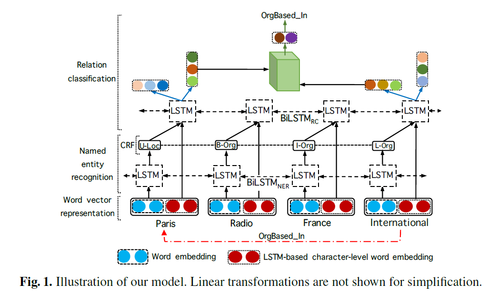

# Joint Entity and Relation

前言：本文为论文泛读整理，CODE模块与实验模块在精度才会予以重视

## Separately

---

### 《End-to-end neural relation extraction using deep biaffine attention》

> 2018-ECIR
> Dat Quoc Nguyen, Karin Verspoor
> The University of Melbourne, Australia

#### Introduction

先判断实体，后判断实体之间的关系。

#### Model Structure

将实体识别后的标签进行embedding，与原embedding拼接后，经过BiLSTM+2个独立的FNN，每个实体输出为两个向量，分别代表该实体作为头实体/尾实体时的输出，公式如下：
$$
h_i^{(head)}=FFNN_{head}(r_i)\\
h_i^{(tail)}=FFNN_{tail}(r_i)
$$

$$
s_{j,k}=Biaffine(h_j^{(head)},h_k^{(tail)}))\\
Biaffine(y_1,y_2)=y_1^TUy_2+W(y_1\ concat \ y_2)+b
$$

将NER和RE的LOSS相加，训练。

#### Shortcoming

1. 本质上还是实体、关系分开抽取
2. 无法处理实体不相邻的情况。
3. 无法处理关系重叠问题...

---

## Tagging

---

### 《Joint Extraction of Entities and Relations Based on a Novel Tagging Scheme》

> 2017-ACL
> Suncong Zheng, Feng Wang
> Institute of Automation, Chinese Academy of Sciences

#### Introduction

联合抽取也细分了两个具体实现途径：1.实体和关系先后抽取。2.真正的联合抽取。

本文为后者。

#### Contribution

1. A novel tagging scheme is propose to jointly extract entities and relations, which can easily transform the extraction problem into a tagging task.
2. Based on our tagging scheme, we study different kinds of end-to-end models to settle the problem.
3. Furthermore, we also develop an end-to-end model with biased loss function to suit for the novel tags. It can enhance the association between related entities.

#### Model Structure

#### Experiment

Dataset：NYT

Evaluation：P、R、F1

> A triplet is regarded as correct when its relation type and the head offsets of two corresponding entities are both correct.
>
> We run 10 times for each experiment then report the average results and their standard deviation.

#### Shortcoming

> In this paper, we focus on the extraction of triplets that are composed of two entities and one relation between these two entities.

1. 一个单词只能有一个tag，即只能构成一种关系，无法处理重叠问题。

---

### ==《PALSTM: Joint extraction of entities and overlapping relations using position-attentive sequence labeling》==

>  2019-AAAI
> Dai Dai, Xinyan Xiao, Yajuan Lyu
> Baidu; Department  of Automation, Tsinghua University

#### Introduction

解决的问题：实体关系联合抽取+关系重叠
解决问题的方案：

- First design a tagging scheme to generate n tag sequences for an n-word sentence.
- Then a position-attention mechanism is introduced to produce different sentence representations for every query position to model these n tag sequences.

#### Model Structure

---

### ==《ETL-Span: Joint extraction of entities and relations based on a novel decomposition strategy》==

> 2020-ECAI
> Bowen Yu, Zhenyu Zhang, Xiaobo Shu

#### Introduction

面对的问题：实体关系联合抽取+实体重叠+Multi-words Entity

解决问题的方案：提出新的tagging scheme，提出先头实体，后尾实体+关系的模型方案。

#### Model Structure

---

## Seq2Seq

---

### ==《CopyRE：Extracting relational facts by an end-to-end neural model with copy mechanism》==

> 2018-ACL
> Xiangrong Zeng, Daojian Zeng
> University of Chinese Academy of Sciences, China

#### Introduction

同一句句子中，不同的关系三元组可能存在重叠问题。而现有联合抽取方法主要关注不存在实体重叠的情况。作者提出关系三元组在同一句子中可能存在重叠，并将其分为三类情况：

1. Normal：没有实体重叠
2. EntityPairOverlap（EPO）：实体对重叠
3. SingleEntityOverlap（SEO)：单个实体重叠

现有大多数方法只对Normal子类进行研究，忽略了一个实体可能存在多关系的情况。这篇文章指向的问题是**关系三元组重叠**的情况。

#### Model Structure

---

## Others

---

### ==《MrMep: Joint extraction of multiple relations and multiple entity pairs based on triplet attention》==

> 2019-CoNLL
> Jiayu Chen, Caixia Yuan, Xiaojie Wang, etc.
> Center of Intelligence Science and Technology School of Computer Science
> Beijing University of Posts and Telecommunications（北邮）

#### Introduction

联合抽取任务的理想目标是抽取文本中所有可能的关系类型，并提取每个目标关系类型的所有候选实体对，同时考虑到三元组之间的复杂重叠。

这篇文章提出的MrMep利用了Triplet Attention来刻画实体-关系间的暗含关系，然后对于每个目标关系，它使用指针网络的变体以顺序方式生成所有头实体和尾实体的边界（起始/结束位置），由此模型生成所有可能的实体。

#### Model Structure

## To Do

1. Effective modeling of encoder-decoder architecture for joint entity and relation extraction
2. A novel cascade binary tagging framework for relational triple extraction
3. End-to-end neural relation extraction with global optimization
4. Tplinker:Single-stage joint extraction of entities and relations through token pair linking
5. Contrastive triple extraction with generative transformer
6. Joint entity and relation extraction with set prediction networks
7. Recurrent interaction network for jointly extracting entities and classifying relations
8. A relation-specific attention network for joint entity and relation extraction
9. A Frustratingly Easy Approach for Joint Entity and Relation Extraction
10. Joint entity recognition and relation extraction as a multi-head selection problem
11. Joint Extraction of Entities and Relations Based on a Novel Decomposition Strategy
12. Span-Level Model for Relation Extraction
13. SpERT：Span-based Joint Entity and Relation Extraction with Transformer Pre-training
14. Table filling multi-task recurrent neural network for joint entity and relation extraction
15. Global normalization of convolutional neural networks for joint entity and relation classification
16. Going out on a limb: Joint extraction of entity mentions and relations without dependency trees
17. 2019 Graphrel: Modeling text as relational graphs for joint entity and relation extraction.