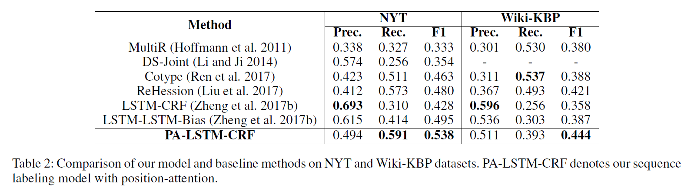
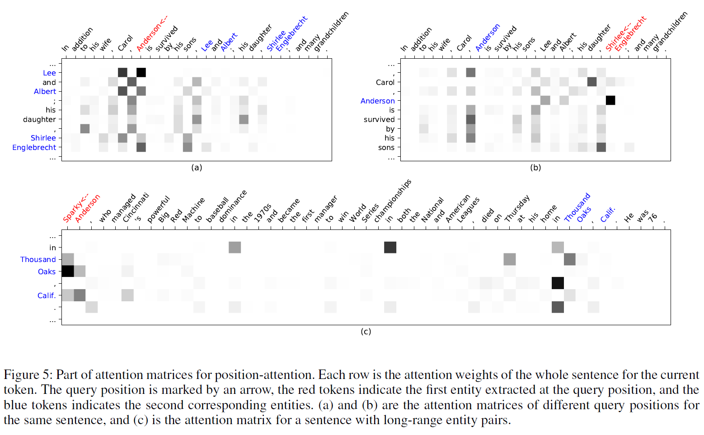

## Joint Extraction of Entities and Overlapping Relations Using Position-Attentive Sequence Labeling

> 2019-AAAI
> Dai Dai, Xinyan Xiao, Yajuan Lyu
> Baidu; Department  of Automation, Tsinghua University

#### 1 Introduction

解决的问题：实体关系联合抽取+关系重叠
解决问题的方案：

- First design a tagging scheme to generate n tag sequences for an n-word sentence.
- Then a position-attention mechanism is introduced to produce different sentence representations for every query position to model these n tag sequences.

即1.新的标注方案（联合抽取问题转换成序列标注问题）；2.设计模型，对文本序列进行序列标注。

**Contributions**

- design a tagging scheme which can simultaneously represent type of entities and overlapping relations
- We propose a position-attention mechanism to produce different position-aware sentence representations according to query position p, which can be used to decode different tag sequences and extract overlapping relations.
- We demonstrate the effectiveness of our method using two public datasets and achieve state-of-art results. Furthermore, the analysis shows that our model performance better on extracting long-range relations, which are usually more difficult.

#### 2 Methodology

首先介绍tagging scheme，将关系重叠的关系抽取问题转换成序列标注问题；然后详细介绍基于该tagging scheme的位置注意力序列标注模型。

##### 2.1 Tagging Scheme

对于由n个单词组成的句子，对每一个词，都标一个序列（图中的一行），深色的是当前$p$位置的标记（若当前词是实体的一部分，则标BIES；如果不是则是O），其他位置，如果和$p$位置实体有关系（$p$位置实体是头实体，其他位置为尾实体），则标BIES-关系类别。

由此可以解决实体重叠和multi-word entities的问题。

##### 2.2 End-to-End Sequence Labeling Model with Position-Attention

模型主要由三部分组成：Bi-LSTM Encoder、Position-Attention Mechanism、CRF Decoder

**BiLSTM Encoder**

文本序列$S=\{{w_t}\}_{t=1}^n$，Bi-LSTM的输入word embedding由两部分组成：$[w_t^w;w_t^c]$，表示word-level representations和CNN网络卷积生成的character-level representations.

LSTM相关公式：
$$
\overrightarrow{h_t}=\overrightarrow{LSTM}(\overrightarrow{h}_{t-1},[w_t^w,w_t^c])\\
\overleftarrow{h_t}=\overleftarrow{LSTM}(\overleftarrow{h}_{t+1},[w_t^w,w_t^c])
$$
**Position-Attention Mechanism**
$$
s_{tj}=v^Ttanh(W^Hh_j+W^ph_p+W^hh_t)\\
a_{tj}=exp(s_{tj})/\sum_{k=1}^nexp(s_{tk})\\
c_t=\sum_{j=1}^{n}a_{tj}h_j
$$
$W^H、W^p、W^h、v$: learnable parameters
$h_j、h_p、h_t$: hidden states at position j, p, t
$s_{tj}$: score computed by comparing $h_p$ and $h_t$ with each of the sentence state $h_j$
$a_{tj}$: attention weight produced by normalization of $s_{tj}$

**CRF Decoder**

输入：position-Attention 产生的$c_t$与$t$位置的$h_t$拼接$u_t=[h_t;c_t]$

输出：第$p$行的标注序列

#### 3 Experiments

**Datasets**: NYT(New York Times news articles)、Wiki-KBP( Wikipedia articles)

**Results**:

#### 4 后话

1. 这种方法把实体标签和关系标签混在一起，如B-PER 和 S-BI，这两类标签应该在不同维度空间吧？

2. 这个模型对每个词，（非O）以该词为头实体，遍历句子每个单词，判断尾实体，以及计算context，复杂度有点高 $N^2$。
3. 计算头尾实体时，只考虑了B-头/尾实体进去，对multi-words entity表现不好。