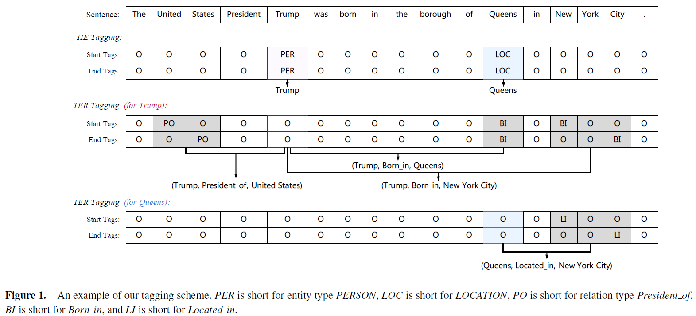
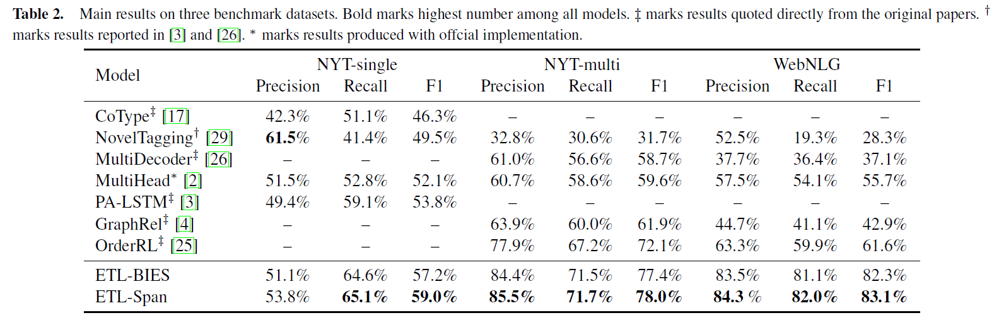

## Joint Extraction of Entities and Relations Based on a Novel Decomposition Strategy

#### 1 Introduction

面对的问题：实体关系联合抽取+实体重叠+Multi-words Entity

解决问题的方案：提出新的tagging scheme，提出先头实体，后尾实体+关系的模型方案。

模型名字：ETL-Span（extract-then-label method with span-based scheme）

**先前模型的不足**

对于Pipeline模型或extract-then-classify类的联合抽取模型：

> "As a result, their relation classifiers may be misled by the redundant entity pairs, since N entities will lead to roughly $N^2$ pairs, and most of which are in the NA(non-relation) class"

即：先抽取实体后判断之间的关系，会存在大量的冗余三元组（关系为NA），需要判断$N^2$个实体对之间的关系。

对于《Joint extraction of entities and relations based on a novel tagging scheme》：无法处理实体重叠问题；对于《Joint extraction of entities and overlapping relations using position-attentive sequence labeling》提出的PA-LSTM：由于统一的一次性标记过程，这些模型往往忽略了头实体、尾实体和关系中包含的依赖关系等内部结构。众所周知，尾部实体和关系应该依赖于特定的头部实体。换句话说，如果一个模型不能完全感知头部实体的语义，那么提取相应的尾部实体和关系将是不可靠的。 

（有点往本文的结构引，我对PA-LSTM的结构还是持正面态度的，它考虑了头尾实体和句子上下文的关系，但并没有考虑头尾实体之间的位置关系，本文在这基础上，将头尾位置关系考虑进来）

**本文模型大致框架**

首先在文本中识别出可能的头实体；然后识别对应的尾实体和关系。

任务描述为：HE（Head-Entity） extraction、TER（Tail-Entity and Relation）extraction.
原始任务分解为：$p(h,r,t|S)=p(h|S)p(r,t|h,S)$. （表示head, relation, tail）

对HE、TER任务，用span-based tagging scheme分解。
HE: entity type is labeled at the start and end positions of each head-entity.
TER: annotate the relation types at the start and end positions of all the tail-entities which have relationship to a given head-entity.

任务被分解为2+2m个序列标注子任务，2表示判断头实体的Start+End，2m表示对m个头实体，分别判断对应尾实体的Start+End及之间的关系。

#### 2 Methodology

##### 2.1 Tagging Scheme

**HE**: two subtasks

> The first subtask mainly focuses on identifying the start position of one head-entity. One token is labeled as the corresponding entity type if it is the start word, otherwise it is assigned the label “O” (Outside). In contrast, the second subtask aims to identify the end position of one head-entity and has a similar labeling process except that the entity type is labeled for the token which is the end word.

**TER**: two subtasks

> The first sequence labeling subtask mainly labels the relation type for the token which is the start word of the tail-entity, while the second subtask tags the end word.

标注法：BIOES

##### 2.2 Hierarchical Boundary Tagger(HBT) 

（生成如2.1所示的标记序列的模块HBT）

作者提出了"hierarchical tagging structure"，对HE或TER任务，首先识别实体的start，然后识别实体的end（埋下伏笔，一个优化方向是：信息应该是双向交互的，尾位置对头位置也有积极影响）。

模型易懂，相关公式如下：

**Start_tag**:
$$
h_i^{sta}=BiLSTM_{sta}([h_i;a_i])\\
P(y_i^{sta})=Softmax(W^{sta}\cdot h_i^{sta}+b^{sta})\\
sta\_tag(x_i)=argmax_kP(y_i^{sta}=k)
$$
$h_i$: token representation
$a_i$: for HE, global representation learned from the entire sentence
	  for TER, concatenation of a global representation and a head-entity-related vector to indicate the position and semantic information of the given head-entity.

**End_tag**:
$$
h_i^{end}=BiLSTM_end([h_i^{sta};a_i;p_i^{se}])\\
P(y_i^{end})=Softmax(W^{end}\cdot h_i^{end}+b^{end})\\
end\_tag (x_i)=argmax_kP(y_i^{end}=k)
$$
其中，$p_i^{se}=\begin{cases} i-s^*, if s^* exists \\ C, otherwise  \end{cases}$

$s^*$: nearest start position before current index.
$p_i^{se}$: relative distance between $x_i$ and $s^*$.
$C$: maximum sentence length.

> In this way, we explicitly limit the length of the extracted entity and teach model that the end position is impossible to be in front of the start position.

##### 2.3 Extraction System

**Shared Encoder**

给定句子$S=\{x_1,...,x_n\}$，将其word embeddings、CNN产生的char-embedding、POS（词性）embedding拼接起来作为输入，$h_i$为输出。
$$
h_i=BiLSTM_{sha}(x_i)
$$
**HE Extractor**

首先将$h_i$与$g$拼接得到特征向量$\tilde{x}_1=[h_i;g]$。"g is a global contextual representation computed by max pooling over hidden states."然后将每个位置的特征向量经过HBT模型得到头实体（start, end）的集合。
$$
R_{HE}=HBT_{HE}(H_{HE})
$$
其中，$H_{HE}=\{\tilde{x}_1,...,\tilde{x}_n\}$
			$R_{HE}={(h_j,type_{h_j})}_{j=1}^m$包含了所有的头实体和对应的实体类型

**TER Extractor**

与HE相区别的是，HBT的输入为$\overline{x}_i=[h_i;g;h^h;p_i^{ht}]$

$h^h=[h_{s_h};h_{e_h}]$: 头实体的start和end的隐状态输出
$p_i^{ht}$: position embedding to encode the relative distance from $x_i$ to $h$.

（在HBT模块中，$a_i=[g;h^h;p_i^{ht}]$）

HBT输入整理为$H_{TER}=\{ \overline{x}_1,...,\overline{x}_n\}$，输出为$R_{TER}=\{(t_o,rel_o\}_{o=1}^z$。其中$t_o$: o-th extracted tail-entity. $rel_o$: its relation tag with the given head-entity.

最后我们可以整理输出为$\{(h,rel_o,t_o\}_{o=1}^z$

#### 3 Experiments 

**Datasets**: NYT-single/ NYT-multi/ WebNLG

**Results**

