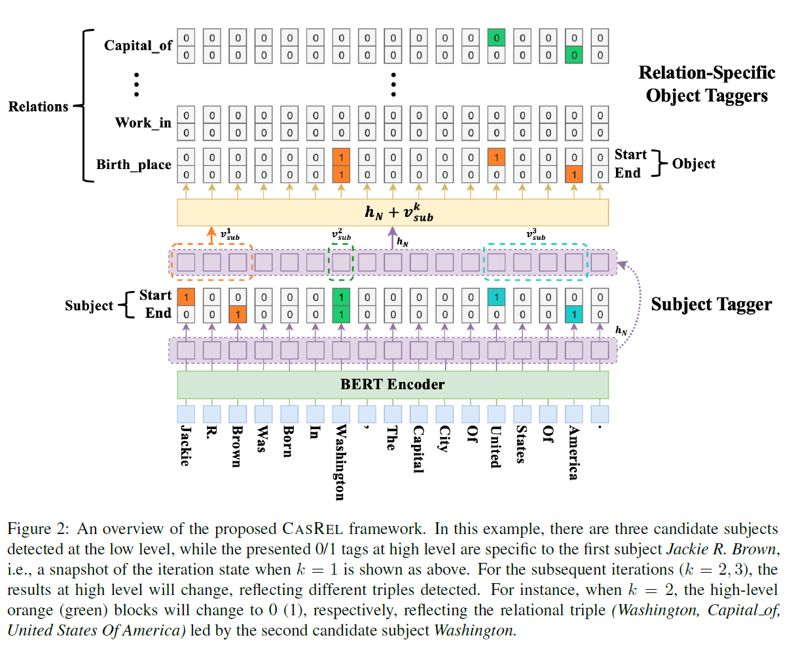
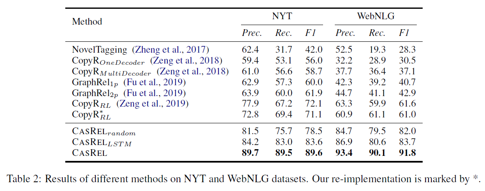

## CasRel: A Novel Cascade Binary Tagging Framework for Relational Triple Extraction

> 2020-ACL
> Zhepei Wei, Jianlin Su
> Jilin University

#### Introduce

三元组$(s,r,o)\ or\ (subject, relation, object)$。

本文旨在解决实体关系联合抽取中三元组重叠（一句话中存在多个三元组）的问题。

对于重叠问题的定义，本文延续了《Zeng et al.:Extracting relational facts by an end-to-end neural model with copy mechanism》三种分类：Normal、EPO（实体对重叠）、SEO（单一实体重叠）。

**先前模型存在的问题：**

之前的抽取实体+关系三元组方法，都是把关系当做离散的分类问题来解决的，即对于一对实体，找到关系。这样存在很多问题。首先，实体的分布是非常不均匀的，大部分句子里也不存在这些三元组，这样一来，这些数据对训练就没什么帮助，浪费掉了。另外，如果同一对实体可能有不同的关系，这就会让分类器很迷惑（我的理解：分类器是函数，是单射，同样的输入只能是同样的输出）。

**本文工作**

之前的模型大多将关系视为离散的标签，给定实体判断标签不同（$f(s,o)\rightarrow r$），而本文将关系建模为“映射头实体至尾实体的特定函数”，$f_r(s)\rightarrow o$。在这个大框架下，联合抽取被分为两个子步骤：1.识别句中所有可能的头实体。2.对每个头实体，利用不同的关系映射函数，识别可能的尾实体。

通俗来说就是：先抽 subject，然后对于每个 subject，挨个看每个关系，判断这个 subject 有没有这个关系的合适的 object。

#### Contribution

1. We introduce a fresh perspective to revisit the relational triple extraction task with a principled problem formulation, which implies a general algorithmic framework that addresses the overlapping triple problem by design.
2. We instantiate the above framework as a novel cascade binary tagging model on top of a Transformer encoder. This allows the model to combine the power of the novel tagging framework with the prior knowledge in pre-trained large-scale language models. 
3. Extensive experiments on two public datasets show that the proposed framework overwhelming outperforms state-of-the-art methods, achieving 17.5 and 30.2 absolute gain in F1-score on the two datasets respectively. Detailed analyses show that our model gains consistent improvement in all scenarios.

#### Model Structure

为了能解决上面说的问题，作者提出了训练集 D 的似然函数：
$$
\prod^{|D|}_{j=1}[\prod_{(s,r,o)\in T_j}p((s,r,o)|x_j)]\\
=\prod^{|D|}_{j=1}[\prod_{s\in T_j}p(s|x_j)\prod_{(r,o)\in T_j|s}p((r,o)|s,x_j)]\\
=\prod^{|D|)}_{j=1}[\prod_{s\in T_j}p(s|x_j)\prod _{r\in T_j|s}p_r(o|s,x_j)\prod_{r\in R/T_j|s}p_r(o_{\varnothing}|s,x_j)]
$$
其中，$x_j $是训练集里的一个句子，$T_j={(s,r,o)} $是 $x_j$ 中的所有三元组的集合，$s∈T_j $表示 $T_j$ 中的 subject $s$，$T_j|s$ 是$ T_j $中 subject 为 $s $的三元组集合，$(r,o)∈T_j|s$ 是其中一对（relation, object），$R $是所有可能关系的集合，$R/T_j|s$ 代表$ T_j $里面所有“除了 $s $为 subject ”的关系的集合。

那么对于一个给定的 subject $s$，如果有包含它的三元组，就计算$\prod _{r\in T_j|s}p_r(o|s,x_j)$ ，作为正例的分数；如果没有包含它的三元组，就计算$\prod_{r\in R/T_j|s}p_r(o_{\varnothing}|s,x_j)]$ ，作为负例的分数。这样一来，就能用上之前方法用不上的训练数据了！

另外，这样一来，就可以不限制地对所有关系进行判断，根本就没有什么三元组的共享实体，就不会有“复用”的问题了。

##### BERT Encoder

输入为单句话，因此没有将BERT的第二个预训练任务考虑在内，以及Embedding上没有将segment embedding纳入embedding过程。

BERT Encoder采用预训练的BERT模型，模型上并无改动。

##### Subject Tagger

这一层 subject tagger 由两个一模一样的二分分类器组成，分别判断每一个 token 是否为 subject 的开始或结束，并为其赋值 0/1。具体在每个 token 上的操作如下：
$$
p_i^{start_s}=\sigma(W_{start}X_i+b_{start})\\
p_i^{end_s}=\sigma(W_{end}X_i+b_{end})
$$
其中$ p_i^{starts}$ 和 $p_i^{ends}$表示句子的第 i 个 token 是 subject 开始/结尾的概率。实验中，超过某一个阈值，就将其 tag 赋为 1。$X_i $是前一步得到的 token 的特征表示。

subject tagger 部分的目标函数即为最大化它的似然函数：
$$
p_\theta(s|X)=\prod_{t\in {start\_s,end\_s}}\prod_{i=1}^L(p_i^t)^{I\{y_i^t=1\}}(1-p_t^t)^{I\{y_i^t=0\}})
$$
其中 $L$ 是句子的长度，$z $为真时，$I\{z\}=1$，$y_i^t∈{0,1} $是第 i 个 token 是 subject 开始/结尾的 tag 值。还是一样，这样的似然函数就用上了所有“不是 subject”的训练数据。

##### Relation-specific Object Taggers

上一步得到 subject 的起始位置之后，作者用一个非常朴素的方法判断 subject：直接取最近的 start 和 end 之间的所有 token 当做 subject，且end需在start之后。

relation-specific object tagger 是对于每一个关系$ r$，计算每一个 token 是这个 subject 和这个 relation 对应的 object 的起始的概率：
$$
p_i^{start_o}=\sigma(W^r_{start}(X_i+v^k_{sub})+b^r_{start})\\
p_i^{end_o}=\sigma(W^r_{end}(X_i+v^k_{sub})+b^r_{end})
$$
其中 $v_{sub}^k $是句子中第 k 个 subject 的 embedding。这里让 $X_i $和 $v_{sub}^k$ 直接相加，我不是很懂，这样得到的结果是这两个词语义的中间值吗？然后为了能让这俩相加，这俩的 shape 需要一样。于是，$v_{sub}^k $直接就是用 这个 subject 中每一个 token 的 embedding 相加得到。

预测object阶段的似然函数：
$$
p_{\varnothing r}(o|s,X)=\prod_{t\in\{start\_o,end\_o\}}\prod^L_{i=1}(p_I^t)^{I\{y_i^t=1\}}(1-p^t_i)^{I\{y_i^t=0\}}
$$

##### 总体似然函数

第三部分起始的似然函数取对数：
$$
\sum^{|D|}_{j=1}[\sum_{s\in T_j}logp_\theta(s|X_j)+\sum_{\{r\in T_j|s\}}ogp_{\varnothing r}(o|s,X_j)+\sum_{\{r\in R/T_j|s\}}logp_{\varnothing r}(o_{\varnothing}|s,X_j)]
$$

#### Experiment

#### Shortcoming

