# 卷积神经网络（CNN）

[TOC]

---

## CNN知识点

### Q1：卷积运算操作

对卷积核中的元素与输入矩阵上对应位置的元素进行逐像素的乘积并求和。然后使用卷积核在输入矩阵上以步长为单位进行滑动，直到遍历完输入矩阵的所有位置。

### Q2：局部连接&权值共享。

局部连接：卷积核尺寸远小于输入特征图的尺寸，输出层上的每个节点都只与输入层的部分节点连接。这个特性存在感受野这一概念。

权值共享：卷积核的滑动窗机制，使得输出层上不同位置的节点与输入层的连接权值都是一样的，即卷积核参数。而在全连接层中，不同节点的连接权值都是不同的。

### Q3：卷积层有哪些基本参数

- 卷积核大小（Kernel Size）：定义了卷积核的感受野

- 卷积核步长（Stride）：定义了卷积核在卷积过程中的步长

- 填充方式（Padding）：在卷积核尺寸不能完美匹配输入的图像矩阵时，需要进行一定的填充策略

  padding=same模式：表示对不足卷积核大小的边界位置进行某种填充（通常是零填充）；

  padding=valid模式：不会对输入特征图进行边界填充，而是直接放弃右侧和下侧卷积核无法滑动到的区域。

- 输入通道数：指定卷积操作时卷积核的深度。

  默认与输入的特征矩阵通道数（深度）一致；在某些压缩模型中会采用通道分离的卷积方式

- 输出通道数：指定卷积核的个数

  若设置为与输入通道数一样的大小，可以保持输入输出维度的一致性；若采用比输入通道数更小的值，则可以减少整体网络的参数量。

### Q4：卷积层的参数量

卷积层的参数量，主要取决于每个卷积核的参数量以及卷积核的个数。

『参数量=输入通道数*输出通道数*卷积核宽度*卷积核高度』

### Q5：卷积层的计算量

卷积层的计算量，由卷积核在每个滑动窗口内的计算量以及整体的滑动次数决定。每个滑动窗口内，卷积操作的计算量大约为『输入通道数*卷积核宽度\*卷积核高度』，而卷积核的滑动次数即输出特征图的数据个数，也就是『输出通道数\*输出特征图宽度\*输出特征图高度』。

### Q6：卷积核大小如何选择

常用的卷积核大小为1\*1,3\*3，5\*5。

两个3*3的卷积核堆叠起来感受野等价于5\*5。三个3\*3的卷积核堆叠起来感受野等价于7\*7。虽然几个小卷积核相比于一个大的卷积核，他们的连通性不变，但小卷积核的参数量和计算复杂度都小于大卷积核。

但是，这并不是表示更大的卷积核就没有作用，在某些领域应用卷积神经网络时仍然可以采用较大的卷积核。譬如在自然语言处理领域，由于文本内容不像图像数据可以对特征进行很深层的抽象，往往在该领域的特征提取只需要较浅层的神经网络即可。在将卷积神经网络应用在自然语言处理领域时，通常都是较为浅层的卷积层组成，但是文本特征有时又需要有较广的感受域让模型能够组合更多的特征（如词组和字符），此时直接采用较大的卷积核将是更好的选择。

综上所述，卷积核的大小并没有绝对的优劣，需要视具体的应用场景而定，但是极大和极小的卷积核都是不合适的，单独的$1\times 1$极小卷积核只能用作分离卷积而不能对输入的原始特征进行有效的组合，极大的卷积核通常会组合过多的无意义特征从而浪费了大量的计算资源。

### Q7：卷积核形状不一定为正方形

对图像而言，横坐标纵坐标是等价的，卷积核为正方体比较合适。

但像以下几类任务，长方体卷积核更好

- 行人检测这类瘦长形目标，长方形的卷积核适用性更好
- 文本分类或其他NLP领域问题，卷积核长度为embedding长度，宽度一般远小于长度。
- 处理音频这类横坐标与纵坐标物理意义不一致的任务，正方形卷积核没有理论支撑

### Q8：池化的作用

池化运算也称为降采样或子采样。概括来说，主要有以下五点作用：

- 增大网络感受野
- 抑制噪声，降低信息冗余
- 降低模型计算量，防止网络过拟合
- 使模型对输入图像中的特征位置变化更加鲁棒（平移不变性，旋转不变形）

### Q9：常见池化操作

- 平均池化：对每个子区域取平均值

  应用场合：保留背景信息

- 最大池化：对每个子区域保留其最大值

  应用场合：提取纹理信息

- 随机池化：将子区域内元素同时除以它们的和，得到概率矩阵；按照概率随机选中方格；该方格位置的值就是pooling得到的值。

  应用场合：对特征图中的元素按照其概率值大小随机选择，即值大的元素被选中概率也大，不像最大池化那样，只取最大值元素。使得随机池化具有更强的泛化能力。

### Q10：池化的分类

- 一般池化：通常包括最大池化和平均池化。以最大池化为例，池化范围和滑窗步长相同，每个位置只被划入一个池化区域。

- 重叠池化：与一般池化操作相同，但是池化范围>滑窗步长，同一区域内的像素特征可以参与多词滑窗提取，得到的特征表达能力更强，但计算量更大。

  

- 空间金字塔池化：在进行多尺度目标的训练时，卷积层允许输入的图像特征尺度是可变的，紧接的池化层若采用一般的池化方法会使得不同的输入特征输出相应变化尺度的特征，而卷积神经网络中最后的全连接层无法对可变尺度进行运算，因此需要对不同尺度的输出特征采样到相同的输出尺度。

  

### Q11：瓶颈结构 & 沙漏结构

#### 瓶颈结构

瓶颈结构是在GoogLeNet/Inception-v1中提出的，而后的ResNet、MobileNet等很多网络也采用并发展了这个结构。瓶颈结构的初衷是为了降低大卷积层的计算量，即在计算较大的卷积层之前，先用一个1×1的卷积来压缩大卷积层输入特征图的通道数目，以减小计算量；在大卷积层完成计算后，根据实际需要，有时会再次使用一个1×1卷积来将大卷积层输出特征图的通道数目复原。由此，瓶颈结构一般是一个小通道数的1×1卷积层，接一个较大的卷积层，后面还会再跟一个大通道数的1×1卷积层。

#### 沙漏结构

沙漏结构一般包括以下两个分支：

1. 自底向上分支：利用卷积、池化等操作将特征图的尺寸逐层压缩（通道数可能增加），类似于自编码器中的编码器。
2. 自顶向下分支：利用反卷积或插值等上采样操作将特征图的尺寸逐层扩大（通道数可能降低），类似于自编码器中的解码器。

沙漏结构的作用一般是将多尺度信息进行融合；同时，沙漏结构单元中堆叠的多个卷积层可以提升感受野，增强模型对小尺寸但又依赖上下文的物体的感知能力。

### Q12：批归一化

#### Internal Covariate Shift（ICS）

在深层网络训练的过程中，由于网络参数的变化而引起内部结点数据分布发生变化的这一过程被称作Internal Convariate Shift。

换句话说，随着训练的进行，网络中的参数也随之不断更新。一方面，当底层网络中参数发生微弱变化时，由于每一层的线性变换与非线性激活映射，这些微弱变化随着网络层数的加深而被放大（类似蝴蝶效应）；另一方面，参数的变化导致每一层的输入分布会发生改变，进而上层的网络需要不停的去适应这些分布变化，使模型训练更加困难。

Internal Convariate Shift带来的问题：

- 上层网络需要不停调整来适应输入数据分布的变化，导致网络学习速度的降低
- 网络的训练过程容易陷入梯度饱和区，减缓网络收敛速度。（？）

#### 减缓ICS的方法（白化、批归一化）

1. 白化

   白化是机器学习中常用的规范化数据分布的方法，主要包括PCA白化和ZCA白化。

   白化是对输入数据分布进行变换，进而达到：

   - 使得输入特征分布具有相同的均值和方差。PCA白化保证了所有特征分布均值为0，方差为1；而ZCA白化则保证了所有特征分布均值为0，方差相同。
   - 去除特征之间的相关性。

   白化的缺陷：

   - 涉及协方差矩阵的运算，计算量较大
   - 白化过程由于改变了网络每一层的分布，因而改变了网络层本身数据的表达能力。底层网络学习到的参数信息会被白化操作丢失掉。

2. Batch Normalization

   针对白化的两个局限，BN一方面简化计算过程；另一方面规范化处理让数据尽可能保留原始的表达能力。
   
   - 单独对每个特征进行normalization，让每个特征服从均值为0，方差为1的分布
   
   - 增加线性变换操作，保留原始输入特征的分布信息。
     $$
     \mu_{\beta}=\frac{1}{m}\sum^m_{i=1}(x_i)\\
     \sigma^2_{\beta}=\frac{1}{m}\sum^m_{i=1}(x_i-\mu_{\beta})^2\\
     \widehat{x}_i=\frac{x_i+\mu_{\beta}}{\sqrt{\sigma^2_{\beta}}+\epsilon}\\
     y_i=\gamma\widehat{x}_i+\beta
     $$
     $m$：此次训练样本 batch 的大小
   
     $\mu_{\beta}$：上一层输出数据的均值
   
     $\sigma^2_{\beta}$：上一层输出数据的标准差
   
     $\widehat{x}_i$：归一化处理
   
     $\epsilon$：避免分母为0而加进去的接近于0的极小值
   
     $\gamma$、$\beta$：可学习参数，线性变换的参数
   
   **$\gamma$、$\beta$的作用**
   
   - 保留网络各层在训练过程中的学习成果。如果没有$\beta$和$\gamma$，批归一化退化为普通的标准化，这样在训练过程中，网络各层的参数虽然在更新，但是他们的输出分布却几乎不变，始终是均值为0，方差为1，不能有效地进行学习。添加$\beta$、$\gamma$参数后，网络可以为每个神经元定制分布，保留每个神经元的学习成果。
   - 保证激活单元的非线性表达能力。上面提到，如果没有$\gamma$、$\beta$，批归一化的输出分布始终是均值为0，方差为1。此时，如果激活函数采用诸如sigmoid、tanh等函数，则经过批归一化的数据基本上都落在这些激活函数的近似线性区域，没能力用上它们的非线性区域，削弱模型的非线性特征提取能力和整体的表达能力。
   - 使批归一化模块具有自我关闭能力。若$\beta$和$\gamma$分别取数据的均值和标准差，则可以复原初始的输入值，即关闭批归一化模块。因此，当批归一化导致特征分布被破坏，或者使网络泛化能力减弱时，可以通过这两个参数将其关闭。
   
   **BN的优势**
   
   - BN使得网络中每层输入数据的分布相对稳定，加速模型学习速度
   
   - BN使得模型对网络中的参数不那么敏感，简化调参过程，使得网络学习更加稳定
   
   - BN允许网络使用饱和性激活函数（例如sigmoid，tanh等），缓解梯度消失问题
   
   - BN具有一定的正则化效果
   
     > 参考：https://zhuanlan.zhihu.com/p/34879333；《百面深度学习》
   
   **批归一化放在激活层之前还是之后？**
   
   - 批归一化在激活层之前：有效避免批归一化破坏非线性特征的分布；另外，批归一化还可以使数据点尽量不落入激活函数的饱和区域，缓解梯度消失问题。
   - 批归一化在激活层之后：由于现在常用的激活函数是ReLU，它没有Sigmoid、Tanh函数的那些问题，因此也可以把批归一化放在激活层之后，避免数据在激活层之前被转化成相似的模式从而使得非线性特征分布趋于同化。

---

## 卷积算子及变种

### Q1：1×1卷积

这里的1×1卷积指的是卷积核大小为1×1，卷积核深度与输入通道数相同。假设输入大小为（128\*128\*32），通过8个大小为（1\*1\*32）的卷积核，得到的输出大小为（128\*128\*8），即不改变图像的高度和宽度，而改变通道数。

1×1卷积在GoogLeNet中的Inception模块和ResNet中均有使用。

1×1卷积主要有以下几点作用：

- 实现信息的跨通道交互与整合。考虑到卷积运算的输入输出都是在3个维度（宽、高、多通道），所以1×1卷积实际上就是对每个像素点，在不同的通道进行线性组合，从而整合不同通道的信息。

- 对卷积核通道数进行降维和升维，减少参数量。经过1×1卷积后的输出保留了输入数据的原有平面结构，通过调控通道数，从而完成升维或降维的作用。

- 利用1×1卷积后的非线性激活函数，在保持特征图尺寸不变的前提下，大幅增加非线性。

### Q2：3D卷积

#### 原理

标准卷积是一种2D卷积，在2D卷积中，卷积核在图片上沿着宽和高两个维度滑动，在每次滑动过程中，对应位置的图像元素与卷积核中的参数进行乘加计算，得到输出特征图中的一个值。

处理3D图像或视频时，网络的输入多了一个维度，输入由$(c,height,width)$变为了$(c,depth,height,width)$，其中$c$是通道数，$depth$为输入数据的宽度。因此，对该数据进行处理时，就需要卷积也作出相应的变换，由2D卷积变为3D卷积。2D卷积的尺寸可以表示为$k_h×k_w$，而3D卷积的尺寸可以表示为$k_h×k_w×k_d$。3D卷积的具体的计算方式与2D卷积类似，即每次滑动时与$c$个通道、尺寸大小为$(depth,height,width)$的图像做乘加运算，从而得到输出特征图中的一个值，如下图所示。

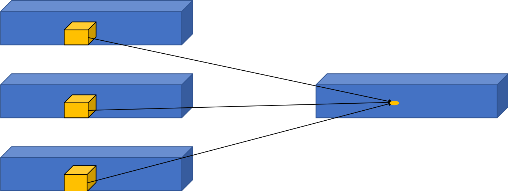

#### 应用

3D卷积的主要应用就是视频理解和医疗图像领域。

在视频理解任务中，$k_d$就代表了时间维度，也就是每个3D卷积核处理的连续帧数。在视频理解领域的3D卷积计算中，首先会将$k_d$个连续帧组成一个3D的图像序列，然后在图像序列中进行卷积计算。3D卷积核会在$k_d$个连续帧上进行滑动，每次滑动$k_d$个连续帧中对应位置内的元素都要与卷积核中的参数进行乘加计算，最后得到输出特征图中的一个值。这使得模型可以从空间和时间的维度提取特征，从而捕捉从多个连续帧中得到的运动信息。

在医疗图像领域中，医学数据通常是3D的，比如我们要分割出的肿瘤就是3D的。如果用2D的图像处理模型处理3D物体，需要将生物医学影像图片的每一个切片成组的喂给模型进行训练，导致效率低下问题。

### Q3：分组卷积（Group Convolution）

#### 原理

分组卷积最早出现在AlexNet中。受限于当时的硬件资源，在AlexNet网络训练时，难以把整个网络全部放在一个GPU中进行训练。因此，作者将卷积运算分给多个GPU分别进行计算，最终把多个GPU的结果进行融合。因此分组卷积的概念应运而生。

对于尺寸为$H_1*W_1*C_1$的输入矩阵，当标准卷积核的尺寸为$h_1*w_1*C_1$，共有$C_2$个标准卷积核时，标准卷积会对完整的输入数据进行运算，最终得到的输出矩阵尺寸为$H_2*W_2*C_2$。这里我们假设卷积运算前后的特征图尺寸保持不变，则上述过程可以展示为下图。

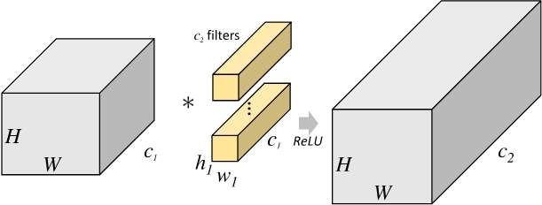

分组卷积则是针对这一过程进行了改进。分组卷积中，通过指定组数$g$来确定分组数量，将输入数据分成$g$组。需要注意的是，这里的分组指的是在深度上进行分组，输入的宽和高保持不变，即将每$\frac{C_1}{g}$个通道的数据分为一组。因为输入数据发生了改变，相应的卷积核也需要进行对应的变化，即每个卷积核的输入通道数也就变为了$\frac{C_1}{g}$，而卷积核的大小是不需要改变的。同时，每组的卷积核个数也由原来的$C_2$变为$\frac{C_2}{g}$ 。对于每个组内的卷积运算，同样采用标准卷积运算的计算方式，这样就可以得到$g$组尺寸为$H_2*W_2*\frac{C_2}{g}$的输出矩阵，最终将这$g$组输出矩阵进行拼接就可以得到最终的结果。这样拼接完成后，最终的输出尺寸就可以保持不变，仍然是$H_2*W_2*C_2$。分组卷积的运算过程如下图所示。

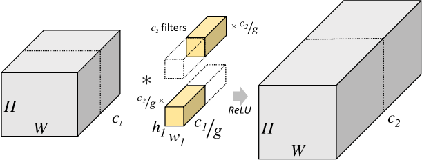

#### 参数量

由于我们将整个标准卷积过程拆分成了$g$组规模更小的子运算来并行进行，所以最终降低了对运行设备的要求。同时，通过分组卷积的方式，参数量也可以得到降低。

在上述的标准卷积中，参数量为$h_1*w_1*C_1*C_2$。

而使用分组卷积后，参数量则变为$h_1*w_1*\frac{C_1}{g}*\frac{C_2}{g}*g=h_1*w_1*C_1*C_2*\frac{1}{g}$。

### Q4：转置卷积（Transposed Convolution）                                     

#### 前言

通常情况下，对图像进行卷积运算时，经过多层的卷积运算后，输出图像的尺寸会变得很小，即图像被缩减。而对于某些特定的任务（比如：图像分割、GAN），我们需要将图像恢复到原来的尺寸再进行进一步的计算。这个恢复图像尺寸，实现图像由小分辨率到大分辨率映射的操作，叫做上采样（Upsample）。

上采样有多种方式，常见的包括：最近邻插值（Nearest neighbor interpolation）、双线性插值（Bi-Linear interpolation）等，但是这些上采样方法都是基于人们的先验经验来设计的，对于很多场景效果并不理想。因此，我们希望让神经网络自己学习如何更好地进行插值，这也就是接下来要介绍的转置卷积的方法。

转置卷积在某些文献中也被称为反卷积。

转置卷积中，不会使用预先设定的插值方法，它具有可学习的参数，通过让网络自行学习，来获取最优的上采样方式。转置卷积在某些特定的领域有着非常广泛的应用，比如：

- 在DCGAN，生成器将会用随机值转变为一个全尺寸(full-size)的图片，这个时候就需要用到转置卷积。
- 在语义分割中，会使用卷积层在编码器中进行特征提取，然后在解码层中进行恢复为原先的尺寸，这样才可以对原来图像的每个像素都进行分类。这个过程同样需要用到转置卷积。经典方法如：FCN和Unet。
- CNN的可视化：通过转置卷积将CNN中得到的特征图还原到像素空间，以观察特定的特征图对哪些模式的图像敏感。

#### 转置卷积数学推导

标准卷积的运算操作其实就是对卷积核中的元素与输入矩阵上对应位置的元素进行逐像素的乘积并求和。然后使用卷积核在输入矩阵上以步长为单位进行滑动，直到遍历完输入矩阵的所有位置。

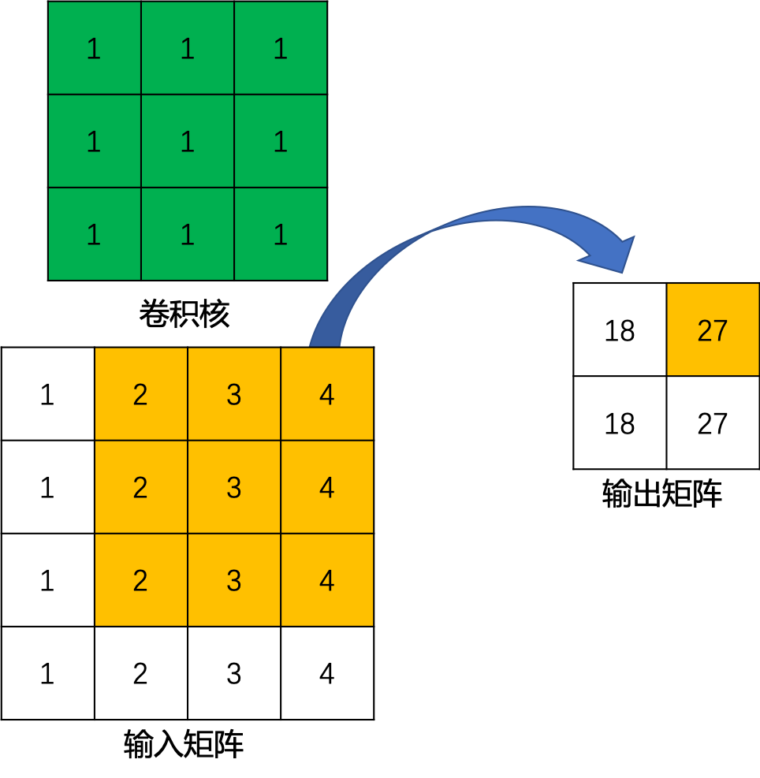

可以将标准卷积操作理解为一个多对一的关系。

对于转置卷积而言，我们实际上是想建立一个逆向操作，也就是建立一个一对多的关系。

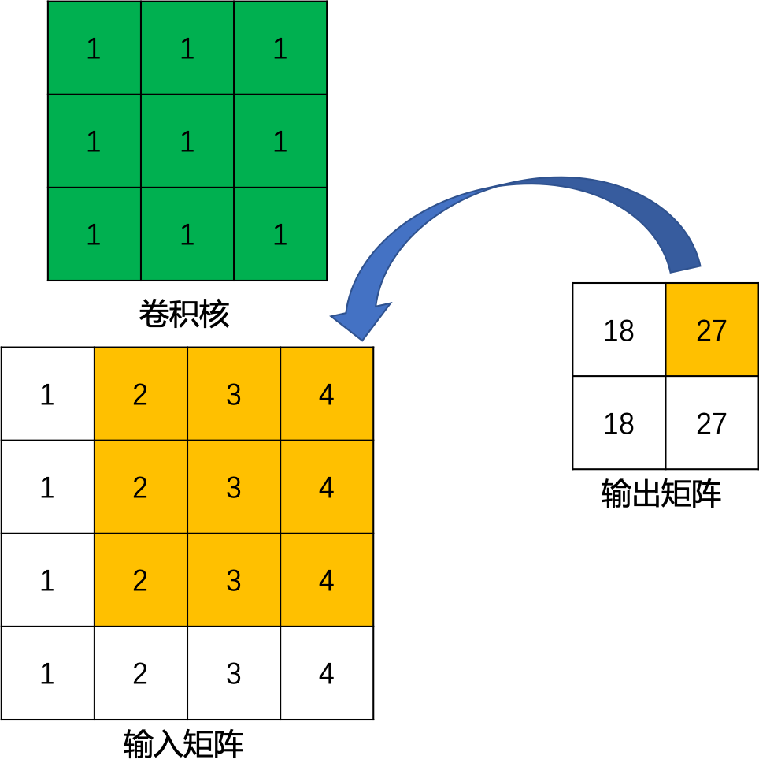

当然，从信息论的角度，卷积操作是不可逆的，==所以转置卷积并不是使用输出矩阵和卷积核计算原始的输入矩阵，而是计算得到保持了相对位置关系的矩阵==。

定义一个尺寸为$4×4$的输入矩阵$input$:
$$
\begin{split}
input=\left[\begin{array}{ccc}
x_1 & x_2 & x_3 & x_4 \\
x_6 & x_7 & x_8 & x_9 \\
x_{10} & x_{11} & x_{12} & x_{13} \\
x_{14} & x_{15} & x_{16} & x_{17} 
\end{array}\right]
\end{split}
$$
一个尺寸为$3×3$的标准卷积核$kernel$：
$$
\begin{split}
kernel=\left[\begin{array}{ccc}
w_{0,0} & w_{0,1} & w_{0,2} \\
w_{1,0} & w_{1,1} & w_{1,2} \\
w_{2,0} & w_{2,1} & w_{2,2}
\end{array}\right]
\end{split}
$$
令步长$stride=1$，填充$padding=0$，按照输出特征图的计算方式$o=\frac{i+2p-k}{s}+1$，我们可以得到尺寸为$2×2$的输出矩阵$output$：
$$
\begin{split}
output=\left[\begin{array}{ccc}
y_0 & y_1 \\
y_2 & y_3
\end{array}\right]
\end{split}
$$
这里，我们换一个表达方式，我们将输入矩阵$input$和输出矩阵$output$展开成列向量$X$和列向量$Y$，那么向量$X$和向量$Y$的尺寸就分别是$16×1$和$4×1$，可以分别用如下公式表示：
$$
\begin{split}
X=\left[\begin{array}{ccc}
x_1 \\ x_2 \\ x_3 \\ x_4 \\
x_6 \\ x_7 \\ x_8 \\ x_9 \\
x_{10} \\ x_{11} \\ x_{12} \\ x_{13} \\
x_{14} \\ x_{15} \\ x_{16} \\ x_{17} 
\end{array}\right]
\end{split}
$$

$$
\begin{split}
Y=\left[\begin{array}{ccc}
y_0 \\ y_1 \\
y_2 \\ y_3
\end{array}\right]
\end{split}
$$

我们再用矩阵运算来描述标准卷积运算，这里使用矩阵$C$来表示新的卷积核矩阵：
$$
Y = CX
$$
经过推导，我们可以得到这个稀疏矩阵$C$，它的尺寸为$4×16$：
$$
\begin{split}
\scriptsize{
C=\left[\begin{array}{ccc}
w_{0,0} & w_{0,1} & w_{0,2} & 0 & w_{1,0} & w_{1,1} & w_{1,2} & 0 & w_{2,0} & w_{2,1} & w_{2,2} & 0 & 0 & 0 & 0 & 0 \\
0 & w_{0,0} & w_{0,1} & w_{0,2} & 0 & w_{1,0} & w_{1,1} & w_{1,2} & 0 & w_{2,0} & w_{2,1} & w_{2,2} & 0 & 0 & 0 & 0 \\
0 & 0 & 0 & 0 & w_{0,0} & w_{0,1} & w_{0,2} & 0 & w_{1,0} & w_{1,1} & w_{1,2} & 0 & w_{2,0} & w_{2,1} & w_{2,2} & 0 \\
0 & 0 & 0 & 0 & 0 & w_{0,0} & w_{0,1} & w_{0,2} & 0 & w_{1,0} & w_{1,1} & w_{1,2} & 0 & w_{2,0} & w_{2,1} & w_{2,2}  
\end{array}\right]
}
\end{split}
$$
这里，用下图直观的展示一下上边的矩阵运算过程。

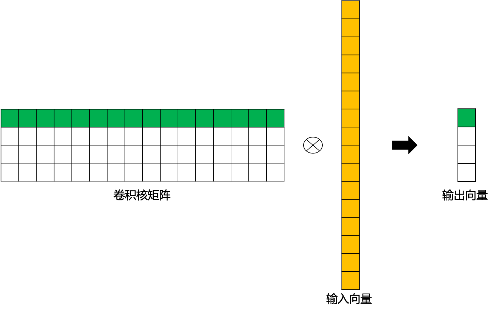

而转置卷积其实就是要对这个过程进行逆运算，即通过$C$和 $Y$得到 $X$ ：
$$
X = C^TY
$$
此时，新的稀疏矩阵就变成了尺寸为$16×4$的$C^T$，这里通过下图直观展示一下转置后的卷积矩阵运算示例。这里，用来进行转置卷积的权重矩阵不一定来自于原卷积矩阵。只是权重矩阵的形状和转置后的卷积矩阵相同。

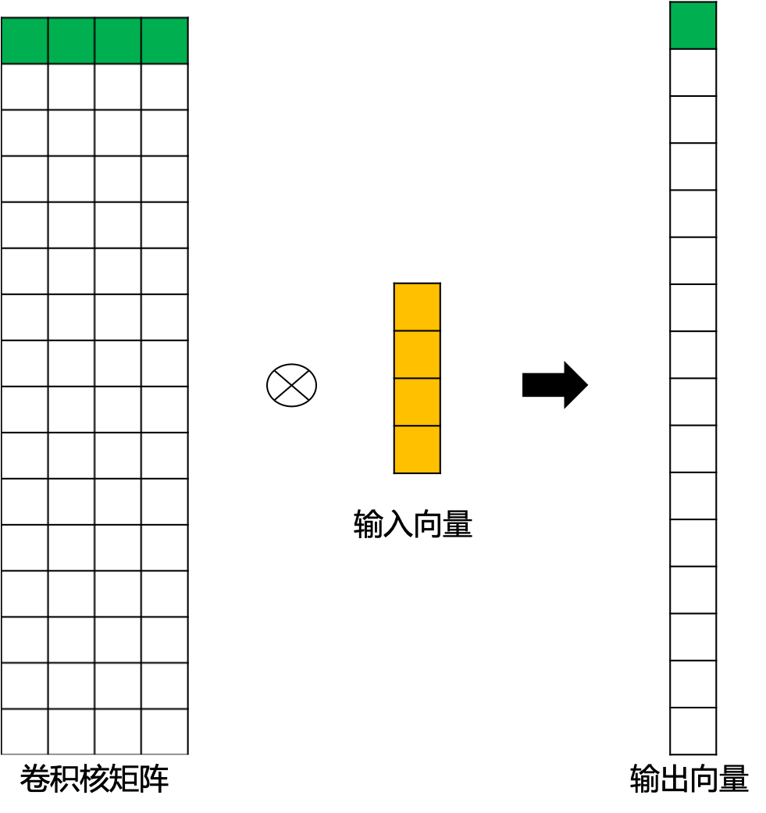

我们再将$16×1$的输出结果进行重新排序，这样就可以通过尺寸为$2×2$的输入矩阵得到尺寸为$4×4$的输出矩阵了。

#### 转置卷积输出特征图尺寸

- **stride=1的转置卷积**

同样使用上文中的卷积核矩阵$C$：
$$
\begin{split}
\scriptsize{
C=\left[\begin{array}{ccc}w_{0,0} & w_{0,1} & w_{0,2} & 0 & w_{1,0} & w_{1,1} & w_{1,2} & 0 & w_{2,0} & w_{2,1} & w_{2,2} & 0 & 0 & 0 & 0 & 0 \\0 & w_{0,0} & w_{0,1} & w_{0,2} & 0 & w_{1,0} & w_{1,1} & w_{1,2} & 0 & w_{2,0} & w_{2,1} & w_{2,2} & 0 & 0 & 0 & 0 \\0 & 0 & 0 & 0 & w_{0,0} & w_{0,1} & w_{0,2} & 0 & w_{1,0} & w_{1,1} & w_{1,2} & 0 & w_{2,0} & w_{2,1} & w_{2,2} & 0 \\0 & 0 & 0 & 0 & 0 & w_{0,0} & w_{0,1} & w_{0,2} & 0 & w_{1,0} & w_{1,1} & w_{1,2} & 0 & w_{2,0} & w_{2,1} & w_{2,2}  \end{array}\right]
}
\end{split}
$$
对应的输出矩阵$ output$为 ：
$$
\begin{split}
output=\left[\begin{array}{ccc}y_0 & y_1 \\y_2 & y_3\end{array}\right]
\end{split}
$$
我们将输出矩阵展开为列向量$Y$：
$$
\begin{split}
Y=\left[\begin{array}{ccc}y_0 \\ y_1 \\y_2 \\ y_3\end{array}\right]
\end{split}
$$
带入到上文中提到的转置卷积计算公式，则转置卷积的计算结果为：
$$
\begin{split}
\scriptsize{
C^Ty'=
\left[\begin{array}{ccc}
w_{0,0}y_0 & w_{0,1}y_0+w_{0,0}y_1 & w_{0,2}y_0+w_{0,1}y_1 & w_{0,2}y_1 \\
w_{1,0}y_0+w_{0,0}y_2 & w_{1,1}y_0+w_{1,0}y_1+w_{0,1}y_2+w_{0,0}y_3 & w_{1,2}y_0+w_{1,1}y_1+w_{0,2}y_2+w_{0,1}y_3 & w_{1,2}y_1+w_{0,2}y_3 \\
w_{2,0}y_0+w_{1,0}y_2 & w_{2,1}y_0+w_{2,0}y_1+w_{1,1}y_2+w_{1,0}y_3 & w_{2,2}y_0+w_{2,1}y_1+w_{1,2}y_2+w_{1,1}y_3 & w_{2,2}y_1+w_{1,2}y_3 \\
w_{2,0}y_2 & w_{2,1}y_2+w_{2,0}y_3 & w_{2,2}y_2+w_{2,1}y_3 & w_{2,2}y_3
\end{array}\right]
}
\end{split}
$$
这其实就等价于填充 $padding=2$，输入为：
$$
\begin{split}
input=\left[\begin{array}{ccc}
0 & 0 & 0 & 0 & 0 & 0 \\
0 & 0 & 0 & 0 & 0 & 0 \\
0 & 0 & y_0 & y_1 & 0 & 0 \\
0 & 0 & y_2 & y_3 & 0 & 0 \\
0 & 0 & 0 & 0 & 0 & 0 \\
0 & 0 & 0 & 0 & 0 & 0
\end{array}\right]
\end{split}
$$
同时，标准卷积核进行转置：
$$
\begin{split}
kernel'=\left[\begin{array}{ccc}
w_{2,2} & w_{2,1} & w_{2,0} \\
w_{1,2} & w_{1,1} & w_{1,0} \\
w_{0,2} & w_{0,1} & w_{0,0}
\end{array}\right]
\end{split}
$$

对于卷积核尺寸为 $k$，步长 $stride=1$，填充$padding=0 $的标准卷积，等价的转置卷积在尺寸为 $i^′$的输入矩阵上进行运算，输出特征图的尺寸$o^′$ 为：
$$
o^′=i^′+(k−1)
$$
同时，转置卷积的输入矩阵需要进行$padding^′=k−1$的填充。

- **stride>1的转置卷积**

在实际使用的过程中，我们大多数时候使用的会是stride>1的转置卷积，从而获得较大的上采样倍率。这里，我们令输入尺寸为$5×5$，标准卷积核的设置同上，步长$stride=2$，填充 $padding=0$，标准卷积运算后，输出尺寸为$2×2$。
$$
\begin{split}
Y=\left[\begin{array}{ccc}y_0 \\ y_1 \\y_2 \\ y_3\end{array}\right]
\end{split}
$$
这里，步长$stride=2$，转换后的稀疏矩阵尺寸变为$25×4$，由于矩阵太大这里不展开进行罗列。则转置卷积的结果为：
$$
\begin{split}
\scriptsize{
C^Ty'=\left[\begin{array}{ccc}
w_{0,0}y_0 & w_{0,1}y_0 & w_{0,2}y_0+w_{0,0}y_1 & w_{0,1}y_1 & w_{0,2}y_1\\
w_{1,0}y_0 & w_{1,1}y_0 & w_{1,2}y_0+w_{1,0}y_1 & w_{1,1}y_1 & w_{1,2}y_1\\
w_{2,0}y_0+w_{0,0}y_2 & w_{2,1}y_0+w_{0,1}y_2 & w_{2,2}y_0+w_{2,0}y_1+w_{0,2}y_2+w_{0,0}y_3 & w_{2,1}y_1+w_{0,1}y_3 & w_{2,2}y_1+w_{0,2}y_3\\
w_{1,0}y_2 & w_{1,1}y_2 & w_{1,2}y_2+w_{1,0}y_3 & w_{1,1}y_3 & w_{1,2}y_3\\
w_{2,0}y_2 & w_{2,1}y_2 & w_{2,2}y_2+w_{2,0}y_3 & w_{2,1}y_3 & w_{2,2}y_3\\
\end{array}\right]
}
\end{split}
$$
此时，等价于输入矩阵添加了空洞，同时也添加了填充，标准卷积核进行转置之后的运算结果。运算过程如下图所示。

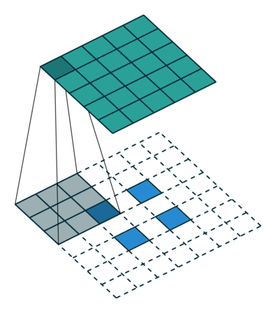

对于卷积核尺寸为 $k$，步长 $stride>1$，填充$padding=0 $的标准卷积，等价的转置卷积在尺寸为 $i^′$的输入矩阵上进行运算，输出特征图的尺寸$ o^′$ 为：
$$
o^′=s(i^′−1)+k
$$
同时，转置卷积的输入矩阵需要进行$padding^′=k−1$ 的填充，相邻元素间的空洞大小为 $s−1$。因此，可以通过控制步长$stride$来控制上采样倍率。

### Q5：空洞卷积（Dilated Convolution）

#### 空洞卷积背景及应用

在像素级预测问题中（比如语义分割，这里以FCN为例进行说明），图像输入到网络中，FCN先如同传统的CNN网络一样对图像做卷积以及池化计算，降低特征图尺寸的同时增大感受野。但是由于图像分割是一种像素级的预测问题，因此我们使用转置卷积进行上采样使得输出图像的尺寸与原始的输入图像保持一致。综上，在这种像素级预测问题中，就有**两个关键步骤**：首先是使用卷积或者池化操作减小图像尺寸，增大感受野；其次是使用上采样扩大图像尺寸。但是，使用卷积或者池化操作进行下采样会导致一个非常严重的问题：图像细节信息被丢失，小物体信息将无法被重建(假设有4个步长为2的池化层，则任何小于 $2^4$pixel 的物体信息将理论上无法重建)。

空洞卷积，在某些文献中也被称为扩张卷积（Atrous Deconvolution），是针对图像语义分割问题中下采样带来的图像分辨率降低、信息丢失问题而提出的一种新的卷积思路。空洞卷积通过引入扩张率这一参数使得同样尺寸的卷积核获得更大的感受野。相应地，也可以使得在相同感受野大小的前提下，空洞卷积比普通卷积的参数量更少。

空洞卷积在某些特定的领域有着非常广泛的应用，比如：

- 语义分割领域：DeepLab系列与DUC。在DeepLab v3算法中，将ResNet最后几个block替换为空洞卷积，使得输出尺寸变大了很多。在没有增大运算量的前提下，维持分辨率不降低，获得了更密集的特征响应，从而使得还原到原图时细节更好。
- 目标检测领域：RFBNet。在RFBNet算法中，利用空洞卷积来模拟pRF在人类视觉皮层中的离心率的影响，设计了RFB模块，从而增强轻量级CNN网络的效果。提出基于RFB网络的检测器，通过用RFB替换SSD的顶部卷积层，带来了显著的性能增益，同时仍然保持受控的计算成本。
- 语音合成领域：WaveNet等算法。

#### 空洞卷积的感受野

空洞卷积的感受野计算方式与标准卷积大同小异。由于空洞卷积实际上可以看作在标准卷积核内填充’0’，所以我们可以将其想象为一个尺寸变大的标准卷积核，从而使用标准卷积核计算感受野的方式来计算空洞卷积的感受野大小。对于卷积核大小为$k$ ，扩张率为 $r$ 的空洞卷积，感受野 $F$ 的计算公式为：
$$
F=k+(k-1)(r-1)
$$
卷积核大小 $k=3$ ，扩张率$ r=2$ 时，计算方式如下图 所示

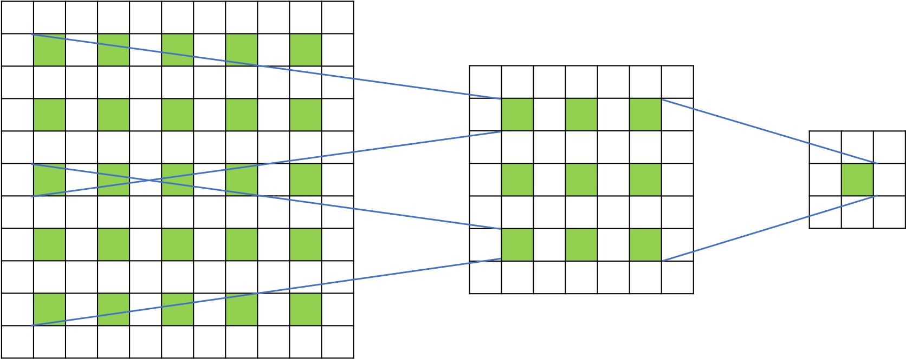

其中，通过一层空洞卷积后，感受野大小为$5×5$，而通过两层空洞卷积后，感受野的大小将会增加到$9×9$。

### Q7：可分离卷积

#### 空间可分离卷积

空间可分离卷积就是在空间维度将标准卷积运算进行拆分，将标准卷积核拆分成多个小卷积核。
$$
\begin{split}
\left[\begin{array}{ccc}
3 & 6 & 9 \\
4 & 8 & 12 \\
5 & 10 & 15
\end{array}\right]
=	
\left[\begin{array}{ccc}
3 \\
4 \\
5
\end{array}\right]	
\times
\left[\begin{array}{ccc}
1 \quad 2 \quad 3
\end{array}\right]
\end{split}
$$
我们可以先用3×1的卷积核做一次卷积，再用1×3的卷积核做一次卷积，从而得到最终结果。

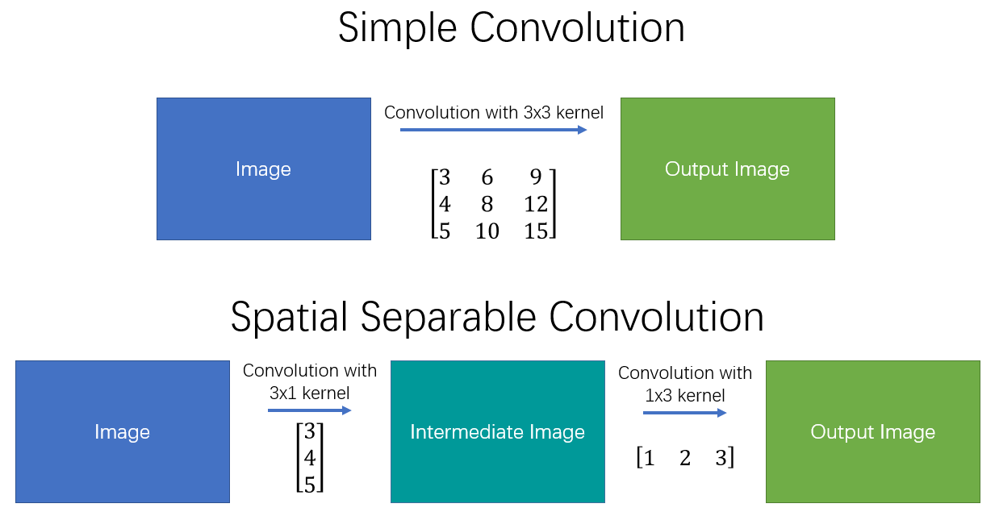

这样，我们将原始的卷积进行拆分，本来需要9次乘法操作的一个卷积运算，就变为了两个需要3次乘法操作的卷积运算，并且最终效果是不变的。可想而知，乘法操作减少，计算复杂性就降低了，网络运行速度也就更快了。

但是空间可分离卷积也存在一些局限，并非所有卷积核都可以拆分成两个较小的卷积核，所以该方法使用并不多。

空间可分离卷积在深度学习中应用较少，在传统图像处理领域比较有名的是可用于边缘检测的sobel算子，分离的sobel算子计算方式如下：
$$
\begin{split}
\left[\begin{array}{ccc}
-1 & 0 & 1 \\
-2 & 0 & 2 \\
-1 & 0 & 1
\end{array}\right]
=	
\left[\begin{array}{ccc}
1 \\
2 \\
1
\end{array}\right]	
\times
\left[\begin{array}{ccc}
-1 \quad 0 \quad 1
\end{array}\right]
\end{split}
$$

#### 深度可分离卷积

##### 原理

深度可分离卷积（depthwise separable convolutions）的不同之处在于，其不仅仅涉及空间维度，还涉及深度维度（即 channel 维度）。通常输入图像会具有3个channel：R、G、B。在经过一系列卷积操作后，输入特征图就会变为多个channel。图像中的每个通道，都是描述图像特征的一种解释说明。

类似空间可分离卷积，深度可分离卷积也是将卷积核分成两个单独的小卷积核，分别进行2种卷积运算：**深度卷积运算**和**逐点卷积运算**。

**深度卷积运算**

深度卷积运算其实就是逐通道进行卷积运算。对于一幅12×12×3的输入图像而言，我们使用大小为5×5的卷积核进行逐通道运算。

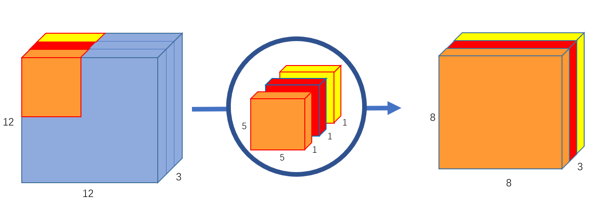

这里其实就是使用3个5×5×1 的卷积核分别提取输入图像中3个 channel 的特征，每个卷积核计算完成后，会得到3个8×8×1 的输出特征图，将这些特征图堆叠在一起就可以得到大小为 8×8×3的最终输出特征图。这里我们可以发现深度卷积运算的一个缺点，深度卷积运算缺少通道间的特征融合 ，并且运算前后通道数无法改变。

因此，接下来就需要连接一个逐点卷积来弥补它的缺点。

**逐点卷积运算**

逐点卷积运算本质上就是1×1卷积，因为其会遍历每个点，所以我们称之为逐点卷积。

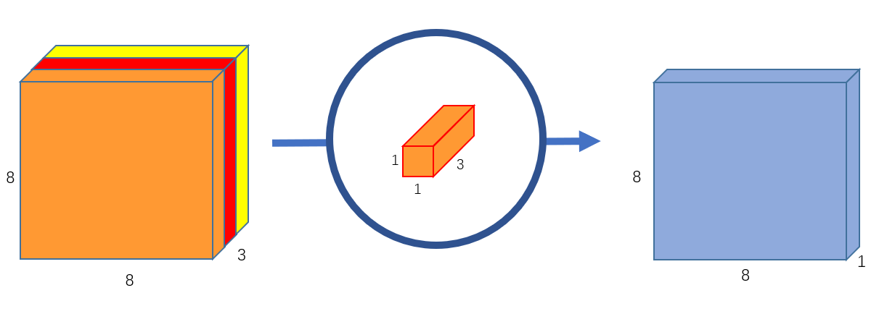

此外，我们可以创建256个3通道的 1×1 卷积对上文中得到的8×8×3 的特征图进行运算，这样，就可以实现得到与标准卷积运算一致的8×8×256 的特征图的功能。

##### 作用

相同效果的标准卷积运算，用256个5×5×3的卷积核，每个卷积核在输入图片上移动8×8次，乘法运算个数为256×3×5×5×8×8=1228800。

而换成深度可分离卷积后，在深度卷积运算时，使用3个5×5×1的卷积核在输入图片上移动8×8次，乘法运算个数为3×5×5×8×8=4800；逐点卷积运算时，使用256个1×1×3的卷积在输入特征图上移动8×8次，乘法运算个数为256×1×1×3×8×8=49152。两步运算相加，深度可分离卷积总的乘法运算个数为53952。可以看出计算量少了很多。

##### 应用

MobileNet中使用了深度可分离卷积。相较于左侧的标准卷积，其进行了拆分，同时使用了BN层以及RELU激活函数穿插在深度卷积运算和逐点卷积运算中。

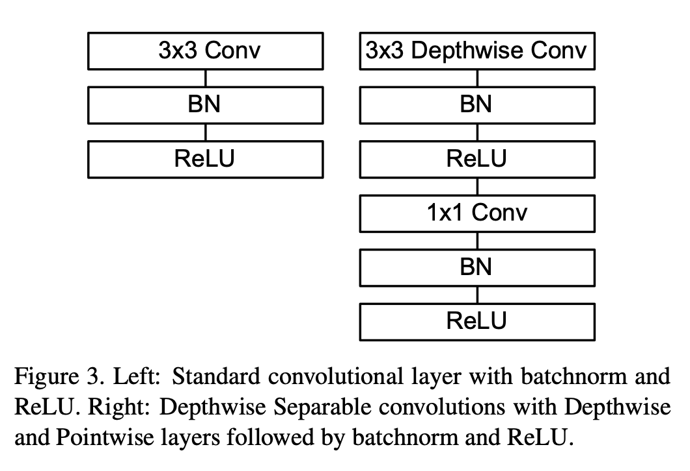

### Q6：可变性卷积（Deformable Convolution）

视觉识别的一个关键挑战是如何适应物体尺度、姿态、视点和零件变形的几何变化或模型几何变换。但对于视觉识别的传统CNN模块，不可避免的都存在**固定几何结构**的缺陷：卷积单元在固定位置对输入特征图进行采样；池化层以固定比率降低空间分辨率；一个ROI（感兴趣区域）池化层将一个ROI分割成固定的空间单元；缺乏处理几何变换的内部机制等。

这些将会引起一些明显的问题。例如，同一CNN层中所有激活单元的感受野大小是相同的，这对于在空间位置上编码语义的高级CNN层是不需要的。而且，对于具有精细定位的视觉识别（例如，使用完全卷积网络的语义分割）的实际问题，由于不同的位置可能对应于具有不同尺度或变形的对象，因此，尺度或感受野大小的自适应确定是可取的。

为了解决以上所提到的局限性，一个自然地想法就诞生了：**卷积核自适应调整自身的形状**。这就产生了可变形卷积的方法。

可变形卷积顾名思义就是卷积的位置是可变形的，并非在传统的N×NN×N的网格上做卷积，这样的好处就是更准确地提取到我们想要的特征（传统的卷积仅仅只能提取到矩形框的特征）

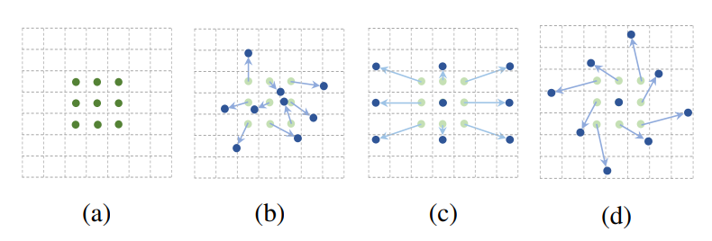

> 详情参考：https://paddlepedia.readthedocs.io/en/latest/tutorials/CNN/convolution_operator/Deformable_Convolution.html#