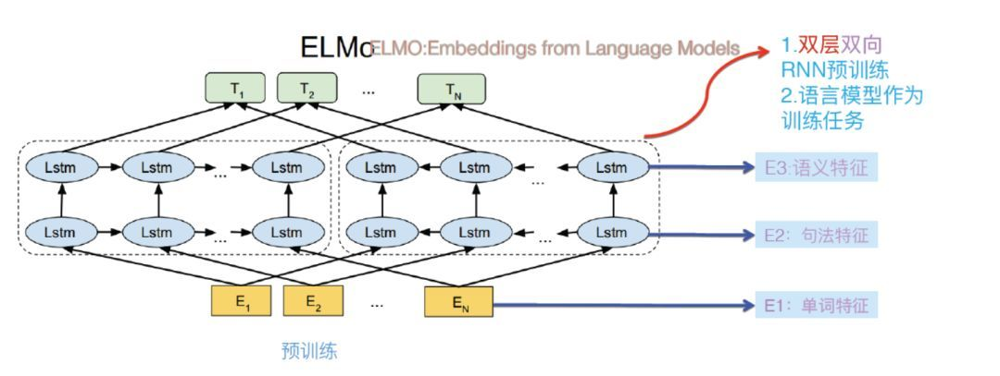
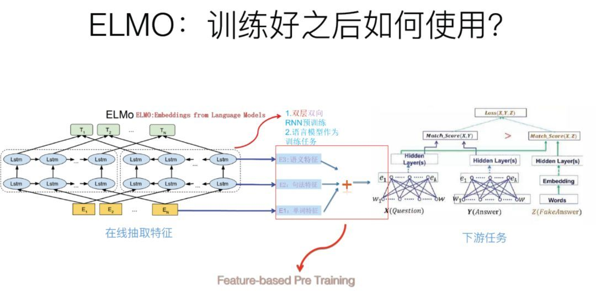
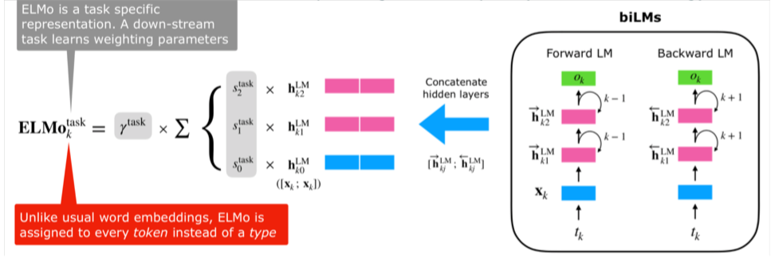
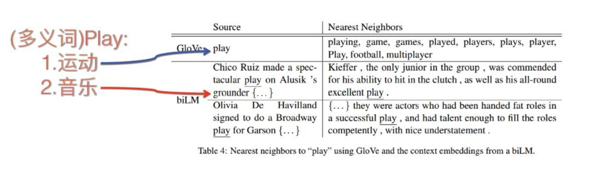

# Word Embedding

[TOC]

## 知识点

> 资源参考：
>
> [word2vec、glove、cove、fastext以及elmo对于知识表达有什么优劣？](https://www.zhihu.com/question/292482891/answer/492247284)
>
> [Word2Vec中为什么使用负采样？](https://zhuanlan.zhihu.com/p/66088781)
>
> [关于word2vec，我有话要说](https://zhuanlan.zhihu.com/p/29364112)
>
> [word2vec（二）：面试！考点！都在这里](https://zhuanlan.zhihu.com/p/133025678)
>
> [nlp中的词向量对比：word2vec/glove/fastText/elmo/GPT/bert](https://zhuanlan.zhihu.com/p/56382372)
>
> [史上最全词向量讲解（LSA/word2vec/Glove/FastText/ELMo/BERT）](https://zhuanlan.zhihu.com/p/75391062)
>
> [word2vec详解（CBOW，skip-gram，负采样，分层Softmax）](https://zhuanlan.zhihu.com/p/53425736)
>
> [Word2Vec详解-公式推导以及代码](https://zhuanlan.zhihu.com/p/86445394)
>
> [关于ELMo，面试官们都怎么问](https://cloud.tencent.com/developer/article/1594557)

### 词表示

#### 独热表示

#### 词的分布式表示

> 《自然语言处理 基于预训练模型的方法》
>
> - 点互信息
> - 奇异值分解

词是承载语义的最基本的单元，而传统的独热表示仅仅将词符号化，不包含任何语义信息。为了将词的语义信息融入词表示中，受到『人们在阅读过程中遇到从未见过的词时，通常会根据上下文来推断其含义以及相关属性』思想的启发，John Rupert Firth于1957年提出分布式语义假设：**词的含义可由其上下文的分布进行表示**。通俗一点来解释：**上下文相似的词，其语义也相似**。

这里的”分布“与中文”统计分布“一词语义对应，描述的是上下文的概率分布。用上下文描述语义的表示方法都可以称作分布表示，如潜在语义分析模型（LSA）、潜在狄利克雷分配模型（LDA）等。

#### 词的嵌入式表示

把文本分散嵌入到另一个空间，一般是从高维空间嵌入到低维空间。

##### Word2Vec

Word2vec从整体上理解，包含两个模型（CBOW和Skip-gram）和两种优化训练方式（负采样和层序softmax）

###### CBOW

###### SkipGram

###### 负采样

###### 层序softmax

##### Glove

##### Elmo

### 文本表示

上面介绍了几种的常见的词表示方法，通过词的表示构成更长文本的表示，就是文本表示涉及的方法。

#### 词袋表示

假设文本中的词语是没有顺序的集合，将文本中的全部词对应的向量表示（可以是独热表示，也可以是分布式表示或词向量）相加，即构成了文本的向量表示。如在使用独热表示时，文本向量表示的每一维恰好是相应的词在文本中出现的次数。

虽然这种文本表示的方法非常简单、直观，但是缺点也十分明显：首先是没有考虑词的顺序信息，导致『张三 打 李四』和『李四 打 张三』，虽然含义不同，但是由于他们包含的词相同，即使词序不同，词袋表示的结果也是一样的；其次是无法融入上下文信息。比如要表示『不 喜欢』，只能将两个词的向量相加，无法进行更细致的语义操作。当然，可以通过增加词表的方法加以解决，这种方法既能部分解决否定词的问题，也能部分解决局部词序的问题，但是随着词表的扩大，会引入更严重的数据稀疏问题。

---

## 面试题

### Word2Vec：CBOW/SkipGram

1. 有没有使用自己的数据训练过Word2vec，详细说一下过程。包括但是不限于：语料如何获取，清理以及语料的大小，超参数的选择及其原因，词表以及维度大小，训练时长等等细节点。
2. Word2vec模型是如何获得词向量的？聊一聊你对词嵌入的理解？如何理解分布式假设？
3. 如何评估训练出来的词向量的好坏
4. Word2vec模型如何做到增量训练
5. 大致聊一下 word2vec这个模型的细节，包括但不限于：两种模型以及两种优化方法（大致聊一下就可以，下面会详细问）
6. 解释一下 hierarchical softmax 的流程(CBOW and Skip-gram)
7. 基于6，可以展开问一下模型如何获取输入层，有没有隐层，输出层是什么情况。
8. 基于6，可以展开问输出层为何选择霍夫曼树，它有什么优点，为何不选择其他的二叉树
9. 基于6，可以问该模型的复杂度是多少，目标函数分别是什么，如何做到更新梯度（尤其是如何更新输入向量的梯度）
10. 基于6，可以展开问一下 hierarchical softmax 这个模型 有什么缺点
11. 聊一下负采样模型优点（为什么使用负采样技术）
12. 如何对输入进行负采样（负采样的具体实施细节是什么）
13. 负采样模型对应的目标函数分别是什么（CBOW and Skip-gram）
14. CBOW和skip-gram相较而言，彼此相对适合哪些场景
15. 有没有使用Word2vec计算过句子的相似度，效果如何，有什么细节可以分享出来
16. word2vec和tf-idf 在相似度计算时的区别？
17. word2vec和NNLM对比有什么区别？（word2vec vs NNLM）
18. word2vec和fastText对比有什么区别？（word2vec vs fastText）
19. glove和word2vec、 LSA对比有什么区别？（word2vec vs glove vs LSA）

### fasttext

1. 详细聊一下Fasttext细节，每一层都代表了什么？它与Wod2vec的区别在哪里？什么情况下适合使用Fasttext这个模型？

### Glove

1. 详细聊一下Glove细节，它是如何进行训练的？有什么优点？什么场景下适合使用？与Word2vec相比，有什么区别（比如损失函数）？
2. glove和word2vec、 LSA对比有什么区别？（word2vec vs glove vs LSA）

### ELMo

1. **ELMO的原理是什么？以及它的两个阶段分别如何应用？（第一阶段如何预训练，第二阶段如何在下游任务使用）**

2. **ELMO的损失函数是什么？它是一个双向语言模型吗？为什么？**

3. **ELMO的优缺点分别是什么？为什么可以做到一词多义的效果？**

4. **ELMo的基本原理是什么？**

   1. ELMO采用了典型的两阶段过程，

      - 「第一个阶段是利用语言模型进行预训练」；
      - 「第二个阶段是在做下游任务时，从预训练网络中提取对应单词的网络各层的Word Embedding作为新特征补充到下游任务中。」

      **第一阶段：利用语言模型进行预训练**

      第一阶段模型总览：

      

      

      上图展示的是其预训练过程，它的网络结构采用了双层双向LSTM，其中单词(token)特征这一块采用的是单词的embedding(是否是预训练好的论文中没有告知)或者采用字符卷积得到其embedding表示

      目前语言模型训练的任务目标是根据单词  的上下文去正确预测单词 ，  之前的单词序列Context-before称为上文，之后的单词序列Context-after称为下文。

      上图中左端的前向双层LSTM代表正方向编码器，输入的是从左到右顺序的除了预测单词外  的上文Context-before；右端的逆向双层LSTM代表反方向编码器，输入的是从右到左的逆序的句子下文Context-after；每个编码器的深度都是两层LSTM叠加。

      「需要注意的是上述残差结构是在训练深层LSTM网络时常用的结构，简单做法就是将LSTM层的输入加到输出上，在官方tensorflow源码中token的embedding没有加到第一层LSTM的输出上」

      使用这个网络结构利用大量语料做语言模型任务就能预先训练好这个网络，如果训练好这个网络后，输入一个新句子 ，句子中每个单词都能得到对应的三个Embedding：

      - 最底层是单词的Word Embedding
      - 往上走是第一层双向LSTM中对应单词位置的Embedding，这层编码单词的句法信息更多一些；
      - 再往上走是第二层LSTM中对应单词位置的Embedding，这层编码单词的语义信息更多一些。

      也就是说，ELMO的预训练过程不仅仅学会单词的Word Embedding，还学会了一个双层双向的LSTM网络结构，而这两者后面都有用。

      **第二阶段：下游任务利用预训练好的embedding**

      第二阶段模型总览：

      

      以QA问题为例，展示下游任务如何利用预训练好的embedding。

      1. 对于问句X，我们可以先将句子X作为预训练好的ELMO网络的输入，这样句子X中每个单词在ELMO网络中都能获得对应的三个Embedding；
      2. 之后给予这三个Embedding中的每一个Embedding一个权重a，这个权重可以学习得来，根据各自权重累加求和，将三个Embedding整合成一个；
      3. 然后将整合后的这个Embedding作为X句在自己任务的那个网络结构中对应单词的输入，以此作为补充的新特征给下游任务使用。

      对于上图所示下游任务QA中的回答句子Y来说也是如此处理。因为ELMO给下游提供的是每个单词的特征形式，所以这一类预训练的方法被称为"Feature-based Pre-Training"。

5. **ELMo的训练过程是什么样的？损失函数是什么？**

   ELMo的训练过程实际上指的是其第一阶段的预训练过程，第一阶段实际上就是在训练一个双向语言模型，假设给定一个序列，该序列含有  个token  ，那么：

   - 前向语言模型通过在给定上文 (Context-before)的情况下对token  的概率建模来计算序列出现的概率：
     - 许多主流的神经语言模型都会先给序列中的token计算一个「上下文无关」的token表示 ，然后将它传递给L层前向LSTM。这样的话，在每个位置 ，每个LSTM层输出一个「上下文相关」的表示 ，其中 (在ELMo中L取2)
   - 后向语言模型与前向类似，但是它是“从后往前建模的”，通过在给定下文 (Context-after)的情况下对token  的概率建模来计算序列出现的概率：
     - 与前向语言模型类似，后向语言模型在每个位置 ，每个LSTM层同样会输出一个「上下文相关」的表示 ，其中 
     - 需要注意的是，上述「上下文无关」的token表示  是前后向语言模型共享的

   因此，由于ELMo结合了前后向语言模型，故其目标是同时最大化前后向语言模型的对数似然：

   其中：

   -  为token表示的参数(前后向语言模型共享)
   -  为softmax分类的参数(前后向语言模型共享)
   -  分别表示前后向语言模型LSTM层的参数

   综上所述，ELMo的训练过程即为一个前后向语言模型的训练过程，通过上述描述则一目了然，而其损失函数即为简单的分类损失，取决于源码实现，不同源码中的实现可能略有不同。

6. **ELMo训练好了如何使用？**

   ELMo训练好了该如何使用实际上指的是其第一阶段的预训练过程训练完毕，下游任务如何利用预训练好的embedding，在问题1中已经有了比较详细的解读，在该问题则对其进行公式化的说明。首先由1可知，对于序列中的每个token，一个L层的双向语言模型就会得到其「2L+1个表示」，即为：

   其中， 为token的表示(即 )， 为每个双向LSTM层得到的表示。

   「需要注意的是，这里是将整个句子输入到双向语言模型(这里用的是双向LSTM网络)中，正向和反向LSTM网络共享token embedding的输入，源码中token embedding、正向、反向LSTM的hidden state均为512维度，一个长度为nsentences的句子，经过ELMo预训练网络，最后得到的embedding的维度为：(n_sentences, 3, max_sentence_length, 1024)」

   那么下游任务如何利用这些表示呢？下游任务将所有表示都利用起来，并给他们分配权重，即为：

   其中， 是经过softmax归一化之后的权重，标量参数  允许任务模型缩放整个ELMo向量。需要注意的是， 是一个超参数，实际上这个参数是经验参数，一定程度上能够增强模型的灵活性。总结起来，整个为下游任务获取embedding的过程即为：

   

   下游任务获取embedding

7. **ELMo的优点是什么？ELMo为什么有效？**

   ELMo利用了深度上下文单词表征，该模型的优点：

   - 引入双向语言模型，其实是 2 个单向语言模型（前向和后向）的集成；
   - 通过保存预训练好的 2 层 biLSTM，通过特征集成或 finetune 应用于下游任务；

   总结来说，通过上述结构，ELMo能够达到区分多义词的效果，每个单词(token)不再是只有一个上下文无关的embedding表示。

   那么ELMo为什么有效呢？我认为主要原因有以下几点：

   - 首先，ELMo的假设前提是一个词的词向量不应该是固定的，所以在多义词区分方面ELMo的效果必然比word2vec要好。
   - 另外，ELMo通过语言模型生成的词向量是通过特定上下文的“传递”而来，再根据下游任务，对原本上下文无关的词向量以及上下文相关的词向量表示引入一个权重，这样既在原来的词向量中引入了上下文的信息，又能根据下游任务适时调整各部分的权重(权重是在网络中学习得来的)，因此这也是ELMo有效的一个原因。

8. **ELMo为什么能达到区分多义词的效果？**

   在ELMo第一阶段训练完成之后，将句子输入模型中在线提取各层embedding的时候，每个单词(token)对应两边LSTM网络的对应节点，那两个节点得到的embedding是动态改变的，会受到上下文单词的影响，周围单词的上下文不同应该会强化某种语义，弱化其它语义，这样就达到区分多义词的效果了。需要注意的是，第一个单词和最后一个单词也是有上下文的，譬如说第一个单词的上文是一个特殊的token <BOS>，下文是除第一个单词外的所有单词，最后一个单词的下文是一个特殊的token <EOS>，上文是除最后一个单词外的所有单词。

   论文中也举例说明了这个问题，图示如下：

   

   多义词问题，来源张俊林老师文章[2]

   上图对于Glove训练出的word embedding来说，多义词比如play，根据它的embedding找出的最接近的其它单词大多数集中在体育领域，这很明显是因为训练数据中包含play的句子中体育领域的数量明显占优导致；而使用ELMo，根据上下文动态调整后的embedding不仅能够找出对应的“演出”的相同语义的句子，而且还可以保证找出的句子中的play对应的词性也是相同的，这是超出期待之处(当然也可能是因为论文中给出的例子都是比较好的例子，不过ELMo这样的做法是值得学习的)。

9. **ELMo把三种不同的向量叠加的意义是什么？这样做能达到什么样的效果？**

   因为通过ELMo模型，句子中每个单词都能得到对应的三个Embedding：

   - 最底层是单词的Word Embedding；
   - 往上走是第一层双向LSTM中对应单词位置的Embedding，这层编码单词的句法信息更多一些；
   - 再往上走是第二层LSTM中对应单词位置的Embedding，这层编码单词的语义信息更多一些。

   「需要注意的是，这里得到的结论是通过实验验证的，是在这样的模型设计中，能够得到上述结论，可能不同模型结构，得到的结论又是不一样的。」

   ELMo把三种不同的向量叠加的意义主要体现在以下两个点：

   - 一是之前很多方法都只用了最顶层LSTM的hidden state，但是通过实验验证，在很多任务中，将每一层hidden state融合在一起会取得更好的效果；
   - 二是在上述实验中得到结论，每一层LSTM得到单词的embedding所蕴含的信息是不一样的，因此将所有信息融合起来，会让单词embedding的表达更丰富。

10. **elmo、GPT、bert三者之间有什么区别？（elmo vs GPT vs bert）**

